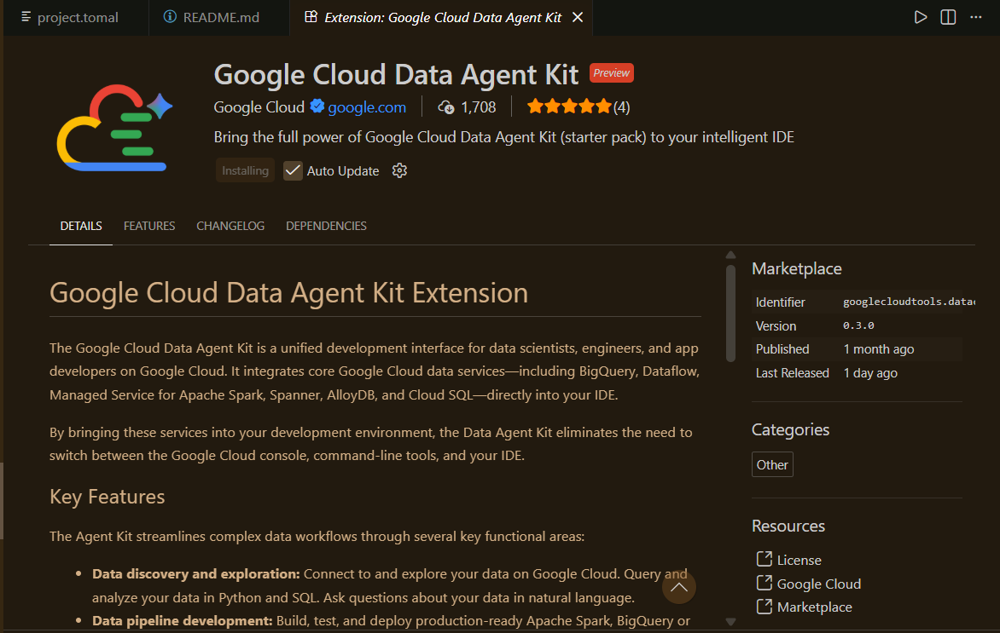
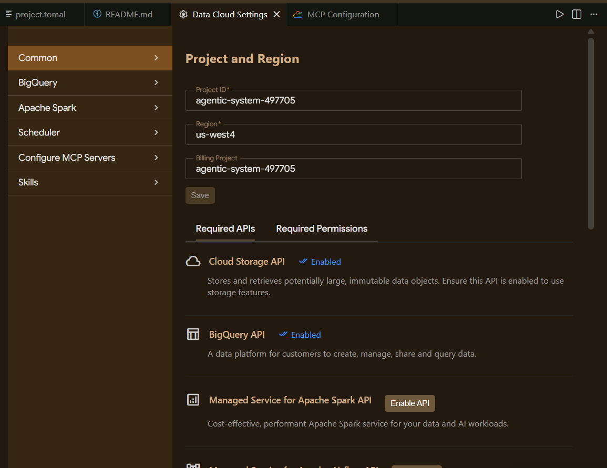
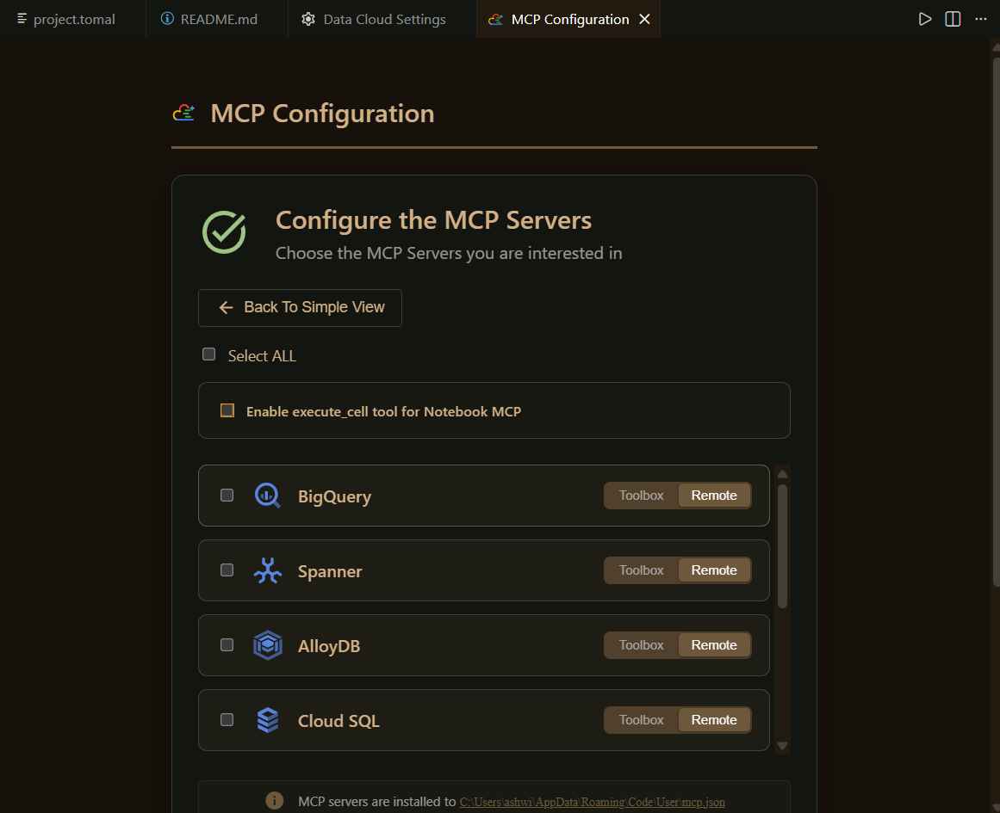

# Chat With Your Data using BigQuery Agents & Antigravity IDE

> **A comprehensive guide to building an enterprise-grade Agentic Data Cloud using Google Cloud technologies**

Build a complete, modern analytics system that transforms raw data into actionable insights through intelligent agents and conversational interfaces.

---

## 📋 Table of Contents

1. [Overview](#overview)
2. [Architecture](#architecture)
3. [What You'll Learn](#what-youll-learn)
4. [Requirements](#requirements)
5. [Quick Start](#quick-start)
6. [Project Components](#project-components)
7. [Key Features](#key-features)
8. [Getting Started](#getting-started)
9. [Resources](#resources)

---

## Overview

This project demonstrates how to build an **Agentic Data Cloud** - a unified platform that combines:

- **Part 1**: BigQuery Knowledge Catalog to transform raw Froyo recipe PDFs into structured, relational tables
- **Part 2**: Zero-ETL transactional bridge federating BigQuery warehouse directly into AlloyDB
- **Part 3**: Multi-Agent application (PropOS) using the Agent Development Kit and MCP Toolbox
- **Part 4**: Dual-track Evaluation Pipeline ensuring production-safe agents through rigorous testing
- **Part 5**: Conversational Analytics in BigQuery for democratized data insights

The system enables developers, business analysts, and executives to interact with data through natural language while maintaining enterprise-grade security and reliability.

---

## Architecture

```
┌─────────────────────────────────────────────────────────────┐
│                    Agentic Data Cloud                        │
├─────────────────────────────────────────────────────────────┤
│                                                               │
│  ┌──────────────┐      ┌──────────────┐      ┌───────────┐  │
│  │  Raw Data    │─────▶│  BigQuery    │─────▶│  AlloyDB  │  │
│  │ (PDF,CSV)    │      │ Knowledge    │      │           │  │
│  └──────────────┘      │  Catalog     │      │           │  │
│                        └──────────────┘      └───────────┘  │
│                              │                      ▲         │
│                              ▼                      │         │
│                        ┌──────────────┐            │         │
│                        │  Multi-Agent │────────────┘         │
│                        │  Application │                      │
│                        │   (PropOS)   │                      │
│                        └──────────────┘                      │
│                              │                              │
│                ┌─────────────┴──────────────┐               │
│                ▼                            ▼               │
│         ┌────────────┐            ┌──────────────────┐      │
│         │Conversational          │ Evaluation       │      │
│         │Analytics   │            │ Pipeline        │      │
│         │in BigQuery │            │                  │      │
│         └────────────┘            └──────────────────┘      │
│                                                               │
└─────────────────────────────────────────────────────────────┘
```

---

## What You'll Learn

### 📚 Core Concepts

- **IDE-First Analytics**: Install and configure the ANTIGRAVITY IDE and Google Cloud Data Agent Kit
- **Conversational BigQuery**: Create and configure BigQuery Data Agents to automate complex SQL tasks
- **Data Democratization**: Publish agents to the enterprise, making them accessible to analysts and executives
- **Visualizing Insights**: Seamlessly integrate agent's conversational analytics into Data Studio dashboards
- **Agentic Data Cloud Ecosystem**: Articulate the value of an end-to-end architecture

### 🛠️ Technical Skills

- Working with **BigQuery Knowledge Catalog** for semantic understanding
- Building **Zero-ETL** bridges between BigQuery and AlloyDB
- Developing **Multi-Agent applications** using Agent Development Kit
- Implementing **Evaluation Pipelines** for agent safety and performance
- Creating **Conversational interfaces** for data analytics

---

## Requirements

### Prerequisites

- A browser such as **Chrome** or **Firefox**
- A **Google Cloud project** with billing enabled
- Basic familiarity with **SQL**
- Understanding of **Google Cloud Platform** basics

### Required APIs

The following Google Cloud APIs must be enabled:

```
- alloydb.googleapis.com
- bigquery.googleapis.com
- run.googleapis.com
- cloudbuild.googleapis.com
- artifactregistry.googleapis.com
- iam.googleapis.com
- secretmanager.googleapis.com
- servicemanagement.googleapis.com
- aiplatform.googleapis.com
- servicenetworking.googleapis.com
```

### Development Tools

- **ANTIGRAVITY IDE**: Download from [antigravity.google](https://antigravity.google)
- **Google Cloud Shell**: Available in Google Cloud Console
- **Cloud Shell Terminal**: For executing commands

---

## Quick Start

### 1. Set Up Your Google Cloud Project

```bash
# In the Google Cloud Console, on the project selector page, select or create a Google Cloud project
gcloud auth list

# Verify your project is set
gcloud config list project

# Enable required APIs
gcloud services enable \
  alloydb.googleapis.com \
  bigquery.googleapis.com \
  run.googleapis.com \
  cloudbuild.googleapis.com \
  artifactregistry.googleapis.com \
  iam.googleapis.com \
  secretmanager.googleapis.com
```

### 2. Install ANTIGRAVITY IDE

1. Download the IDE from [antigravity.google/download](https://antigravity.google)
2. Install and launch the application
3. Authenticate with your Google Cloud account

### 3. Configure the Google Cloud Data Agent Kit

1. Open the Extensions marketplace in ANTIGRAVITY IDE
2. Search for and install the **Google Cloud Data Agent Kit** extension
3. In Settings, configure your project details and region

### 4. Create Your First Agent

1. Create a working folder: `Agent Data Cloud`
2. Create a file named `GEMINI.md` with your agent configuration
3. Add your agent instructions and data sources
4. Test using the chat interface

---

## Project Components

### 📁 Key Files

| File | Purpose |
|------|---------|
| `app.py` | Main Streamlit application for agent interaction |
| `agent_eval.py` | Evaluation pipeline for agent testing |
| `tools.yaml` | BigQuery agent tool definitions |
| `requirements.txt` | Python dependencies |
| `*.csv` | Sample data files (customers, products, orders) |

### 📊 Sample Data

The project includes sample data from the "Froyo" frozen yogurt company:

- **froyo_data.orders**: Historical order headers with dates and totals
- **froyo_data.order_items**: Line item details (quantities, prices)
- **froyo_data.customer_allergen_data**: CRM table tracking customer allergies
- **froyo_data.product**: Product catalog and attributes
- **froyo_data.supplier**: Supplier information

---

## Key Features

### 🤖 Multi-Agent System

Build intelligent agents that can:

- **Understand natural language** queries about your data
- **Generate SQL automatically** from conversational prompts
- **Analyze trends** and forecast future outcomes
- **Answer complex questions** across multiple data sources
- **Provide business insights** without requiring SQL expertise

### 🔒 Enterprise Safety

- Dual-track evaluation pipeline catches hallucinations and jailbreaks
- Rigorous testing ensures production readiness
- Access controls via IAM and BigQuery permissions
- Secure database federation with AlloyDB

### 📈 Data Democratization

- Publish agents for enterprise-wide access
- Conversational interfaces for business users
- Integration with Data Studio for visualizations
- REST API for custom applications

### 🔄 Zero-ETL Integration

- Direct BigQuery warehouse federation into AlloyDB
- Real-time data synchronization
- No data duplication or movement overhead

---

## Getting Started

### Step 1: Prepare Your Data

Download historical data files into your working directory:

```bash
# These are included in the repository
customer_allergen_data.csv
froyo_data.*.csv
orders.csv
order_items.csv
```

### Step 2: Load Data into BigQuery

```bash
# From Cloud Shell Terminal
cd ~/Agent_Data_Cloud

bq load --autodetect \
  --source_format=CSV \
  --skip_leading_rows=1 \
  froyo_data.orders \
  ./orders.csv

bq load --autodetect \
  --source_format=CSV \
  --skip_leading_rows=1 \
  froyo_data.order_items \
  ./order_items.csv

bq load --autodetect \
  --source_format=CSV \
  --skip_leading_rows=1 \
  froyo_data.customer_allergen_data \
  ./customer_allergen_data.csv
```

### Step 3: Configure Your Agent

Edit `GEMINI.md` with your agent instructions:

```markdown
## 1. Project Context
Project ID: <YOUR_PROJECT_ID>
Domain: This project is centralized around "Froyo", a brand of frozen yogurt offering multiple flavors.
Context: The Data Agent Kit enables you to use Antigravity IDE to query your architecture directly from your development environment.

## 2. Execution & Data Processing Rules
- CRITICAL RULE - Customer Data**: Existing Froyo customer data resides in BigQuery in the tables froyo_data.*.

## 3. Knowledge Sources
- froyo_data.orders
- froyo_data.order_items
- froyo_data.customer_allergen_data
```

### Step 4: Test Your Agent

Ask questions like:

```
"Does Midnight Swirl contain any allergen?"

"I want to see the top 5 most popular products 
purchased by customers who have a registered Dairy allergen."

"Forecast the sales volume of our top non-dairy products 
for the next 30 days based on historical data."
```

---

## Example Images

### Setup and Configuration


*ANTIGRAVITY IDE configuration with Google Cloud Data Agent Kit*


*Agent configuration and testing interface*


*Chat interface for agent interaction and data querying*

---

## Project Workflow

### Phase 1: Data Preparation
Transform unstructured data (PDFs, CSVs) into structured BigQuery tables using Knowledge Catalog.

### Phase 2: Zero-ETL Bridge
Federate BigQuery data directly into AlloyDB for transactional workloads without data movement.

### Phase 3: Multi-Agent System
Build intelligent agents using the Agent Development Kit with secure database tools via MCP Toolbox.

### Phase 4: Safety & Evaluation
Implement dual-track evaluation pipeline to catch hallucinations and ensure production readiness.

### Phase 5: Analytics Democratization
Enable conversational analytics in BigQuery for enterprise-wide data insights.

---

## 📚 Resources

### Official Documentation

- [BigQuery Documentation](https://cloud.google.com/bigquery/docs)
- [ANTIGRAVITY IDE](https://antigravity.google)
- [Google Cloud Data Agent Kit](https://cloud.google.com/docs/agents)
- [AlloyDB Documentation](https://cloud.google.com/alloydb/docs)
- [Gemini for Google Cloud](https://cloud.google.com/gemini)

### Learning Paths

- [Agent Development Kit Documentation](https://cloud.google.com/docs/agents)
- [BigQuery ML Guide](https://cloud.google.com/bigquery/docs/bqml-intro)
- [Data Studio Tutorial](https://support.google.com/datastudio)

### Community

- [Google Cloud Community](https://www.googlecloudcommunity.com/)
- [Stack Overflow - BigQuery](https://stackoverflow.com/questions/tagged/google-bigquery)
- [Google Cloud Slack Community](https://googlecloud-community.slack.com)

---

## 🎯 Success Criteria

You have successfully completed this codelab when you can:

✅ Install and configure ANTIGRAVITY IDE with Google Cloud Data Agent Kit  
✅ Create and configure BigQuery Data Agents  
✅ Query your data warehouse using natural language  
✅ Publish agents to the enterprise  
✅ Visualize agent insights in Data Studio  
✅ Build a complete Agentic Data Cloud architecture  

---

## 📝 License

This project is licensed under the Creative Commons Attribution 4.0 License. For details, see [LICENSE](LICENSE).

---

## 👥 Lab done by 

**Ashwin Mehta**

**Last Updated:** May 25, 2026

---

## 🚀 Next Steps

- Deploy your agent to production
- Implement advanced evaluation metrics
- Integrate with additional data sources
- Build custom agent tools for your business logic
- Create dashboards for continuous monitoring

**Ready to build your Agentic Data Cloud? Start with the Quick Start section above!**
